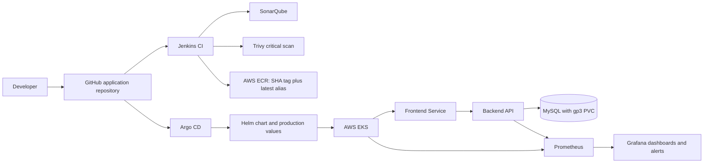

# Production-Grade 3-Tier DevOps Deployment on AWS EKS

A portfolio project that builds a small frontend, backend, and MySQL application; scans and publishes containers through Jenkins; and deploys them to Kubernetes through Helm and Argo CD. Prometheus and Grafana provide cluster and application monitoring.

> **Cost status:** EKS and its associated AWS resources are currently destroyed. The steps below do not run Terraform or create AWS resources automatically. EKS, EC2 nodes, EBS volumes, and the frontend LoadBalancer incur charges when recreated. Review the Terraform plan and AWS pricing before applying it.

## Architecture



Jenkins builds, scans, and pushes images. It does not deploy to Kubernetes. Argo CD watches the Git repository and reconciles the Helm release. The current single-repository layout keeps the chart and Argo CD configuration together; a separate GitOps repository is optional.

## Technology stack

| Area | Tools |
|---|---|
| Application | Node.js 24, Express, Nginx, MySQL 8 |
| Containers | Docker, Docker Compose |
| CI and security | Jenkins, SonarQube, Trivy |
| Registry | AWS ECR |
| Infrastructure | Terraform, AWS VPC, EKS, EC2 managed node group |
| Kubernetes delivery | Kubernetes, Helm, Argo CD |
| Monitoring | Prometheus Operator, Prometheus, Grafana, metrics-server |

## Repository structure

```text
backend/                 Express API, package files, Dockerfile
frontend/                Static UI, Nginx config, Dockerfile
database/                Database assets (if used)
helm/devops-3tier/       Canonical Helm chart and production override
gitops/                  Argo CD Applications and monitoring values
k8s/                     Standalone Kubernetes manifests and gp3 StorageClass
terraform/               VPC, EKS, node group, EBS CSI identity/add-ons
Jenkinsfile              CI: SonarQube, image build, Trivy, ECR push
docker-compose.yml       Local three-service environment
```

## Local application

Prerequisites: Docker Desktop with Compose, Git, and a text editor.

1. Run `Copy-Item .env.example .env`, open `.env` with `notepad .env`, and replace both placeholder passwords with local values. `.env` is ignored by Git.
2. From the repository root, run `docker compose --env-file .env up --build`.
3. Open `http://localhost:8080`. The backend is reachable locally at `http://localhost:3000`; MySQL is mapped to port `3307`.
4. Stop the containers with `docker compose down`. To remove the local database volume as well, use `docker compose down --volumes`.

Do not reuse local development passwords in AWS or production.

## Terraform and AWS infrastructure

Terraform is in `terraform/`. The VPC includes public and private subnets, but the current EKS managed node group uses public subnets to avoid NAT Gateway charges. The EKS API is public but now requires an explicit allowlist of public IPv4 CIDRs. Restrict it to your current public IP as a `/32`.

Example from PowerShell, replacing the sample address with your own public IP:

```powershell
terraform -chdir=terraform init
terraform -chdir=terraform validate
terraform -chdir=terraform plan -var='cluster_endpoint_public_access_cidrs=["203.0.113.10/32"]'
terraform -chdir=terraform apply -var='cluster_endpoint_public_access_cidrs=["203.0.113.10/32"]'
```

Read the plan before applying. Expected chargeable resources include the EKS control plane, two EC2 `t3.small` nodes and their disks, EBS volumes for MySQL/Prometheus/Grafana/Alertmanager, ECR image storage, and an AWS LoadBalancer for the frontend. The monitoring stack plus application may put pressure on `t3.small`; use a larger node type if pods remain pending or nodes run short of memory. A NAT Gateway is intentionally absent to control recurring costs.

For a rough lower bound, current public rates are about `$0.10` per EKS cluster-hour and `$0.0209` per `t3.small` Linux instance-hour in us-east-1. Running the control plane and two nodes continuously for a 730-hour month is about `$103.51` before EBS, public IPv4, frontend LoadBalancer, data transfer, and taxes. A 17 GiB total for the four declared application/monitoring gp3 claims adds about `$1.36` per month if all claims are provisioned for the entire month. Public IPv4 is billed per address-hour, and the frontend LoadBalancer also has hourly/usage charges. These are examples, not a final quote; see [EKS pricing](https://aws.amazon.com/eks/pricing/), [T3 instance pricing](https://aws.amazon.com/ec2/instance-types/t3/), [EBS pricing](https://aws.amazon.com/ebs/volume-types/), [VPC public IPv4 pricing](https://aws.amazon.com/vpc/pricing/), and [Load Balancer pricing](https://aws.amazon.com/elasticloadbalancing/pricing/).

Terraform configures the EKS Pod Identity Agent, the EBS CSI driver, its IAM role, and the Pod Identity association. It does not create the `gp3` StorageClass; apply that after the cluster is ready:

```powershell
aws eks update-kubeconfig --region us-east-1 --name devops-3tier-eks
kubectl apply -f k8s/gp3-storageclass.yaml
kubectl get storageclass gp3
```

If the IAM role `devops-eks-ebs-csi-role` already exists from earlier manual setup, import it into Terraform state before applying rather than trying to create a duplicate. Confirm the current AWS state first. For an existing role, the import command is `terraform -chdir=terraform import aws_iam_role.ebs_csi devops-eks-ebs-csi-role`.

Destroy resources when finished to control cost:

```powershell
terraform -chdir=terraform destroy -var='cluster_endpoint_public_access_cidrs=["203.0.113.10/32"]'
```

Check the destroy plan and the AWS console for leftover EBS volumes, LoadBalancers, snapshots, or manually-created resources. `terraform destroy` only removes resources tracked in that Terraform state.

## Docker images and Jenkins CI

The Jenkins pipeline in `Jenkinsfile` runs these stages:

1. Checkout and project structure checks.
2. SonarQube static analysis.
3. Build backend and frontend Docker images.
4. Scan both images with Trivy, failing on Critical findings.
5. Authenticate to ECR using the Jenkins credential `aws-credentials` and push images.

Each build now publishes an immutable-by-convention full Git commit SHA tag as well as a `latest` compatibility alias. Trivy scans the SHA-tagged images. The ECR repositories should eventually enforce tag immutability for SHA tags while allowing the `latest` alias to remain mutable. Jenkins does not deploy to EKS or change cluster resources.

Jenkins is expected to run with the already configured Docker host, AWS credentials, SonarQube installation, and scanner. Never place AWS keys, SonarQube tokens, or registry passwords in this repository.

## SonarQube, Trivy, and ECR

- **SonarQube** reports code quality findings during CI. Configure the Jenkins SonarQube server and scanner names to match the `Jenkinsfile`, and store its token in Jenkins credentials.
- **Trivy** scans the built container images and blocks a build on Critical findings. Review findings and upgrade the affected base image or package; do not silence a finding without documenting why.
- **ECR** stores `devops-backend` and `devops-frontend`. EKS worker nodes need permission to pull from those repositories. Use repository policies or the node role; do not embed registry credentials in Kubernetes manifests.

## Kubernetes Secrets

The Helm chart and standalone manifests reference a pre-created Secret named `devops-3tier-db`. Passwords are not stored in Helm values or Kubernetes YAML. Run `notepad database-secrets.env` to create an ignored local file with these keys and your own strong values:

```text
mysql-user=devopsuser
mysql-password=REPLACE_WITH_A_STRONG_PASSWORD
mysql-root-password=REPLACE_WITH_A_DIFFERENT_STRONG_PASSWORD
```

After EKS is available, create the namespace and secret:

```powershell
kubectl create namespace app --dry-run=client -o yaml | kubectl apply -f -
kubectl create secret generic devops-3tier-db -n app --from-env-file=database-secrets.env
```

The secret file is ignored by Git. Do not paste secret values into a committed YAML file or shell command history. MySQL uses these values only when initializing a new database directory; if restoring an existing database volume, the credentials must match that database.

Grafana also uses a Secret named `grafana-admin` in the `monitoring` namespace. Create an ignored `grafana-admin.secrets.env` file with Notepad containing `admin-user=admin` and a unique `admin-password`, then run:

```powershell
kubectl create namespace monitoring --dry-run=client -o yaml | kubectl apply -f -
kubectl create secret generic grafana-admin -n monitoring --from-env-file=grafana-admin.secrets.env
```

Kubernetes Secrets are base64-encoded in etcd by default, not encrypted automatically. For a longer-lived production cluster, enable EKS secret encryption with AWS KMS and limit RBAC access to Secrets.

## Helm chart and image promotion

`helm/devops-3tier/` is the canonical application chart. The Argo CD application uses `values-prod.yaml` in that chart directory. Frontend and backend begin with two replicas; HPAs can scale each from two to four based on CPU. MySQL remains a single replica with a persistent claim; it is not horizontally scaled.

After a Jenkins build succeeds, copy its full Git SHA tag into both `frontend.image.tag` and `backend.image.tag` in `helm/devops-3tier/values-prod.yaml`, change both `image.pullPolicy` settings to `IfNotPresent`, then commit and push that change to the application repository. Argo CD notices the Git change and rolls out the pinned images. This promotion is deliberately separate from Jenkins' image build; Jenkins never runs `kubectl` or `helm upgrade` against the cluster. The first promotion requires a successful build of the current source before replacing `latest` with a SHA.

## Argo CD and GitOps

Argo CD is installed in the EKS cluster; the repository stores its Application resources. The main application is defined in `gitops/bootstrap/application.yaml`. It points to this repository, renders the Helm chart, deploys to namespace `app`, and enables automated sync and self-healing. Pruning is disabled because the chart manages the MySQL PVC; deleting it can lose database data.

Install Argo CD after EKS is ready. Keep its UI private and access it through port-forwarding:

```powershell
kubectl create namespace argocd
kubectl apply --server-side --force-conflicts -n argocd -f https://raw.githubusercontent.com/argoproj/argo-cd/v3.5.3/manifests/install.yaml
kubectl -n argocd get pods
kubectl -n argocd port-forward svc/argocd-server 8081:443
```

Get the initial login password with:

```powershell
$encodedPassword = kubectl -n argocd get secret argocd-initial-admin-secret -o jsonpath='{.data.password}'
[System.Text.Encoding]::UTF8.GetString([System.Convert]::FromBase64String($encodedPassword))
```

Then open `https://localhost:8081` and sign in as `admin`. Do not create a public LoadBalancer for the Argo CD UI. The repo is currently public; if it becomes private, configure repository credentials in Argo CD without committing a token.

## Prometheus and Grafana

Monitoring configuration is in `gitops/monitoring/`. It pins `kube-prometheus-stack` chart version `89.2.0` and the Kubernetes-maintained `metrics-server` chart version `3.14.0`. The stack supplies Prometheus, Grafana, node-exporter, kube-state-metrics, Kubernetes dashboards, and alert rules. The app chart exposes `/metrics` and creates a ServiceMonitor and backend availability alert after the Prometheus Operator CRDs exist. The custom backend dashboard is in `gitops/monitoring/dashboard-config/` and is installed by `dashboard-application.yaml`.

Create the Grafana Secret first, then install monitoring applications:

```powershell
kubectl apply -k gitops/monitoring
kubectl -n monitoring get pods
```

Wait until the monitoring pods are healthy before applying the app Application so its ServiceMonitor and PrometheusRule CRDs are available:

```powershell
kubectl apply -k gitops/bootstrap
kubectl -n argocd get applications
kubectl -n app get pods,services,pvc
kubectl apply -f gitops/monitoring/dashboard-application.yaml
```

Prometheus retains seven days of data. Grafana, Prometheus, and Alertmanager use gp3 persistent volumes. Grafana is a ClusterIP service; use port-forwarding to reach it:

```powershell
kubectl -n monitoring port-forward svc/kube-prometheus-stack-grafana 3000:80
```

Open `http://localhost:3000` and sign in using the Grafana Secret. Built-in dashboards show cluster/node/pod CPU and memory and Kubernetes resource health. The backend's `http_requests_total` and `process_uptime_seconds` metrics provide application telemetry; the `BackendUnavailable` alert checks scrape availability.

## Production settings included

- CPU/memory requests and limits for application containers.
- Readiness and liveness probes; MySQL also has a startup probe.
- CPU-based HPA for frontend/backend. Metrics Server must be healthy for HPA metrics.
- Non-root frontend/backend containers, dropped Linux capabilities, read-only frontend/backend root filesystems, and RuntimeDefault seccomp.
- Kubernetes Secrets for DB credentials; MySQL remains single-replica with persistent storage.
- `Always` image pull policy while using the mutable `latest` compatibility tag; switch to `IfNotPresent` when values are promoted to SHA tags.
- ClusterIP for backend/MySQL, LoadBalancer for the public frontend, and private in-cluster monitoring services.

The frontend LoadBalancer is public and chargeable. Replacing it with an Ingress requires an AWS Load Balancer Controller and additional setup/cost, so that is not enabled here.

## Troubleshooting

| Symptom | Checks |
|---|---|
| `ImagePullBackOff` | Confirm the SHA exists in ECR, the repository/account/region are correct, and worker nodes can pull from ECR. |
| `CreateContainerConfigError` | Confirm `devops-3tier-db` exists in `app` and has all three required keys. |
| MySQL PVC pending | Check EBS CSI pods, Pod Identity association, `gp3` StorageClass, node AZ, and PVC events. |
| Backend not ready | Check `kubectl -n app logs deploy/backend`, MySQL pod readiness, DB secret values, and service name `mysql`. |
| HPA shows unknown metrics | Check `kubectl -n kube-system get deployment metrics-server` and `kubectl top nodes`. |
| Argo app OutOfSync | Inspect the Application events and sync result. Check repo access, branch `main`, chart rendering, and that monitoring CRDs are installed before the app chart. |
| Grafana has no app metrics | Check `ServiceMonitor/backend`, Prometheus targets, the `release: kube-prometheus-stack` label, and `/metrics` from a backend pod. |
| Pods pending or OOMKilled | Inspect `kubectl describe pod`, node memory, resource requests, PVC binding, and node-group capacity. Monitoring plus the app can exceed a small node group's capacity. |

Useful commands:

```powershell
kubectl -n argocd get applications
kubectl -n app get pods,services,pvc,hpa
kubectl -n app describe pod <pod-name>
kubectl -n app logs deploy/backend
kubectl -n monitoring get pods,pvc
kubectl top nodes
kubectl top pods -A
```

## Cleanup

1. Remove the app, monitoring, and metrics-server Argo Applications after confirming whether MySQL data must be kept.
2. If data is disposable, remove the MySQL PVC and its EBS volume only after verifying the target cluster and claim.
3. Run `terraform destroy` with the same endpoint CIDR variable used to create the cluster.
4. Check AWS for leftover EBS volumes, snapshots, LoadBalancers, and IAM resources. Delete only resources confirmed to belong to this project.
5. `docker compose down --volumes` removes local database data.

Destroying the cluster does not automatically remove every manually created AWS resource or every EBS volume. Verify the AWS console and billing dashboard.

## Security notes

- Never commit `.env`, `database-secrets.env`, `grafana-admin.secrets.env`, cloud keys, or tokens.
- Keep the EKS public API allowlist limited to trusted IP ranges.
- Keep Argo CD and Grafana ClusterIP-only; use port-forwarding for local access.
- Use full Git commit SHA image tags for releases; configure ECR immutability before relying on tag immutability as an enforcement control.
- Rotate credentials outside Git and reinitialize or update MySQL carefully; changing a Kubernetes Secret alone does not rotate credentials inside an already initialized MySQL database.
- The current single MySQL pod and node-local AWS lab design are suitable for a portfolio demonstration, not a highly available production database. A managed database and backup/restore design would be needed for production data.

## Interview explanation

> A developer pushes source to GitHub. Jenkins checks code with SonarQube, builds Docker images, blocks Critical vulnerabilities with Trivy, and publishes commit-SHA-tagged images to ECR. Argo CD watches the repository and applies the Helm release to EKS, so Jenkins does not hold Kubernetes deployment credentials. Kubernetes runs the frontend, backend, and stateful MySQL service. Prometheus collects cluster, pod, and backend metrics; Grafana presents dashboards and alerts. Terraform recreates the network, cluster, node group, and EBS CSI identity when the environment is needed, and the infrastructure is destroyed after the demonstration to control cost.

## Resume-ready summary

Built a three-tier AWS EKS deployment with Terraform, Docker, Jenkins CI, SonarQube, Trivy, ECR, Helm, and Argo CD GitOps; added Kubernetes probes, resource limits, HPA, Secret-based database credentials, non-root containers, and Prometheus/Grafana monitoring with cost-aware infrastructure cleanup.
